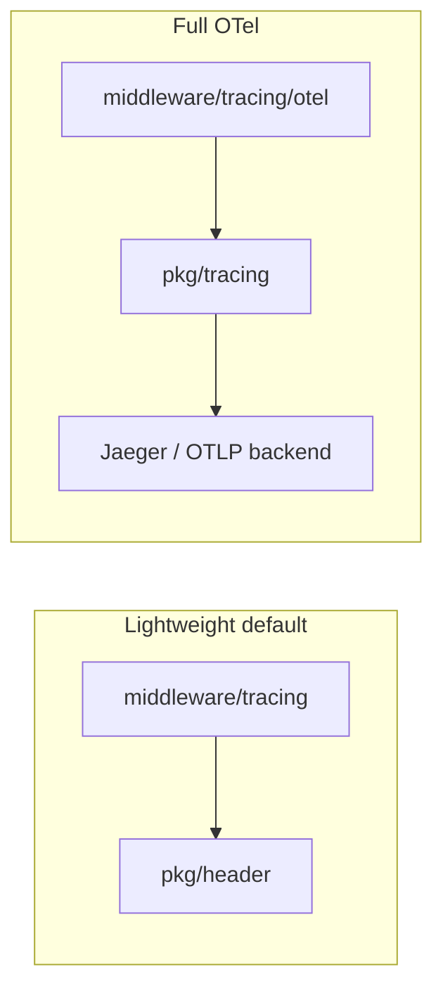

# pkg/tracing

OpenTelemetry tracing utilities for **gkit** applications. This is an **optional submodule** (`github.com/ml444/gkit/pkg/tracing`) so the main `gkit` module does not pull OTel SDK dependencies unless you import it.

## When to use what

| Need | Package | Dependency |
|------|---------|------------|
| Trace ID in logs / headers only | [`middleware/tracing`](../../middleware/tracing/) | Main module |
| Full spans (Jaeger, etc.) | **this package** + [`middleware/tracing/otel`](../../middleware/tracing/otel/) | OTel SDK |



## Quick start (gkit httpx + grpcx)

### 1. Initialize exporter (application `main`)

```go
package main

import (
    "context"
    "log"
    "os"
    "os/signal"
    "syscall"

    "github.com/ml444/gkit/pkg/tracing"
)

func main() {
    shutdown, err := tracing.Setup(tracing.Config{
        ServiceName:  "user-api",
        OTLPEndpoint: "localhost:4318", // OTLP/HTTP (Jaeger 1.35+, OTel Collector, Tempo)
        OTLPInsecure: true,            // http for local dev
        SampleRatio:  1.0,
    })
    if err != nil {
        log.Fatal(err)
    }
    defer func() { _ = shutdown(context.Background()) }()

    // ... start httpx / grpcx servers
    quit := make(chan os.Signal, 1)
    signal.Notify(quit, syscall.SIGINT, syscall.SIGTERM)
    <-quit
}
```

`InitTracer(url, serviceName)` still works but is **deprecated**; use `Setup` for graceful `shutdown`.

### 2. Wire middleware

```go
import (
    traceotel "github.com/ml444/gkit/middleware/tracing/otel"
    "github.com/ml444/gkit/transport/httpx"
    "github.com/ml444/gkit/transport/grpcx"
)

httpx.NewServer(
    httpx.SetHTTPMiddlewares(traceotel.HTTPMiddleware()),
    httpx.Middleware(traceotel.Server()),
)

grpcx.NewServer(
    grpcx.Middlewares(traceotel.Server()),
    grpcx.UnaryInterceptor(traceotel.UnaryServerInterceptor()),
)
```

Trace IDs are also written to `X-Trace-Id` via [`pkg/header`](../header/) for access logs.

### 3. `go.mod` replace (required in your app)

```go
require (
    github.com/ml444/gkit v0.x.x
    github.com/ml444/gkit/pkg/tracing v0.0.0
    github.com/ml444/gkit/middleware/tracing/otel v0.0.0
)

replace (
    github.com/ml444/gkit => ../gkit
    github.com/ml444/gkit/pkg/tracing => ../gkit/pkg/tracing
    github.com/ml444/gkit/middleware/tracing/otel => ../gkit/middleware/tracing/otel
)
```

## API reference

### Bootstrap

| API | Description |
|-----|-------------|
| `Setup(Config)` | Install global `TracerProvider`; returns `shutdown` |
| `InitTracer(url, name)` | Deprecated Jaeger-only helper |
| `TraceID(ctx)` / `SpanID(ctx)` | Read from active OTel span |
| `Provider()` | Global `TracerProvider` |

### Tracer

| API | Description |
|-----|-------------|
| `NewTracer(kind, opts...)` | Server or client tracer |
| `(t *Tracer) Start(ctx, operation, carrier)` | Begin span; extract/inject W3C headers |
| `(t *Tracer) End(ctx, span, msg, err)` | Finish span, status, proto size |

Options: `WithTracerProvider`, `WithTracerName`, `WithPropagator`.

Default propagator: custom `Metadata` + W3C `Baggage` + `TraceContext`.

### Goroutine trace cache (legacy)

| API | Description |
|-----|-------------|
| `CacheTraceId` | Per-goroutine map keyed by `goid` |
| `SyncTraceIDToCache(ctx)` | Copy OTel trace ID into cache (otel middleware does this) |
| `ClearTraceIDCache()` | Clear current goroutine entry |
| `GetTraceIdFromCache(goid)` | Read for custom log `TradeIDFunc` |

Prefer `header.GetTraceID(ctx)` or `tracing.TraceID(ctx)` in new code. The cache exists for log frameworks that only expose `routineId`.

### gRPC

| API | Description |
|-----|-------------|
| `ClientHandler` | `stats.Handler` to attach peer attributes to client spans |

## Module layout

| File | Role |
|------|------|
| `setup.go` | `Setup`, `SyncTraceIDToCache`, global provider |
| `tracing.go` | `TraceID`, `SpanID`, deprecated `InitTracer` |
| `tracer.go` | Span start/end |
| `metadata.go` | OTel `TextMapPropagator` hook (extensible) |
| `span.go` | gRPC semantic attributes helpers |
| `cache.go` | Goroutine-local trace ID for legacy logs |
| `statshandler.go` | gRPC client stats handler |
| `mw.go` | Pointer to middleware integration (HTTP/gRPC in `middleware/tracing/otel`) |

## Known limitations & optimization notes

### Already addressed in this module

- Removed debug `fmt.Println` from cache miss and gRPC `ClientHandler`
- `Setup` supports sampling ratio and returns `shutdown`
- Removed hard-coded debug resource attribute from `InitTracer`
- OTel middleware syncs trace ID to `pkg/header` and optional goroutine cache

### Recommended follow-ups

1. **Default exporter is OTLP/HTTP** — not the removed Jaeger exporter. Jaeger 1.35+ receives traces on port **4318** (OTLP). Old `14268/api/traces` URLs are not supported.

2. **`Metadata` propagator is a no-op** — `Inject`/`Extract` are stubs. Implement or remove if you need `x-md-service-name` propagation.

3. **`SetClientSpan` / `SetServerSpan`** — `remote`, `operation`, `rpcKind` are never set; attributes are incomplete. Prefer `tracer.End` proto size only, or wire transport context into these helpers.

4. **`traceIdCache` memory** — Map grows with goroutines unless cleared; always `defer ClearTraceIDCache()` after `SyncTraceIDToCache`, or avoid cache in new services.

5. **Go version** — Submodule uses `go 1.19`; align with main module (`go 1.23`) when publishing.

6. **semconv versions** — `tracer.go` uses semconv v1.4.0 indirectly; `span.go` uses v1.12.0; unify on upgrade.

## Production checklist

- [ ] Call `Setup` once in `main`, defer `shutdown` on exit
- [ ] Set `SampleRatio` &lt; 1.0 under high traffic
- [ ] Use `middleware/tracing/otel` on httpx + grpcx
- [ ] Keep lightweight `middleware/tracing` if you do not need backends
- [ ] Log correlation: `header.CorrelationID(ctx)` or `tracing.TraceID(ctx)`
- [ ] Plan OTLP migration if Jaeger collector is not used

## See also

- [middleware/OPTIONAL.md](../../middleware/OPTIONAL.md) — optional deps overview
- [pkg/header](../header/) — `X-Trace-Id` / context helpers
- [middleware/tracing/otel/README.md](../../middleware/tracing/otel/README.md) — middleware-only quick reference
